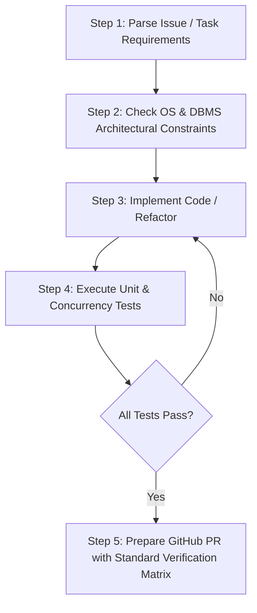

# AGENTS.md — Agent & Developer Operating Handbook

Welcome to the **Smart Emergency Resource Allocation & Hospital Referral System** project repository. This document defines the operating guidelines, architectural mandates, task workflows, and GitHub collaboration standards (PRs & Issues) for AI agents and human developers contributing to this codebase.

---

## 1. Project Context & Mission

### 1.1 Core Mission
> **"Not just the nearest hospital — the nearest suitable hospital that can actually handle the emergency."**

This project bridges real-world emergency healthcare logistics with foundational **Computer Science principles**:
1. **Database Management Systems (DBMS):** Relational schema, ACID transactions, row-level locks, and immutable audit logging for emergency requests, beds, doctors, and ambulances.
2. **Operating Systems (OS):** Priority-based scheduling, process state lifecycles (`NEW` $\to$ `WAITING` $\to$ `ALLOCATED` $\to$ `IN_TREATMENT` $\to$ `COMPLETED`), mutual exclusion / synchronization, resource locking, and deadlock avoidance via Banker's Algorithm.

---

## 2. Core Architectural & Engineering Principles

All agents modifying this codebase MUST uphold the following principles:

1. **Strict Mutual Exclusion on Scarce Resources:**
   - Resources (ICU beds, ventilators, operating theatres, specialists) must NEVER be double-allocated.
   - Use atomic database locking or transaction isolation (`SELECT ... FOR UPDATE` or optimistic version locking).
2. **Priority-Driven Emergency Scheduling:**
   - High-severity emergency triage cases (e.g., Level 1 Cardiac/Polytrauma) must always preempt or take precedence in referral ranking over lower-severity requests.
3. **Closed-Loop Acceptance Handshake:**
   - No patient or ambulance is routed without explicit acceptance from the receiving facility or automated TTL failover to the next candidate hospital.
4. **Safety Boundary:**
   - This system is an operational resource coordination tool, NOT a clinical diagnostic tool. Never generate features that claim automated clinical diagnosis or medical prescription.

---

## 3. End-to-End Task & Development Workflow

Agents and developers must adhere to this structured workflow for all code modifications:



### 3.1 Step-by-Step Task Execution Protocol
- **Step 1: Understand & Plan:** Review `PRD.md` and `WORKFLOW.md`. Identify affected database entities and OS synchronization primitives.
- **Step 2: Isolation & Branching:** Create a descriptive branch following `feat/<issue-id>-<name>` or `fix/<issue-id>-<name>`.
- **Step 3: Implementation:**
  - Maintain clean separation: Presentation / Frontend, API Controllers, Business Logic & OS Engine, DBMS Layer.
  - Implement soft locks (90s TTL) for referral acceptance requests.
- **Step 4: Testing & Concurrency Verification:**
  - Execute unit tests for mathematical scoring algorithms.
  - Execute concurrency stress tests (simulating $N$ parallel requests for 1 resource).
  - Verify safe-state checks (Banker's Algorithm).
- **Step 5: PR Formulation:** Structure PRs using the mandatory GitHub PR format with all test case evidence attached.

---

## 4. GitHub Issue Formation Standards

When creating or refining issues, use the following standardized formats:

### 4.1 Feature Issue Format
```markdown
### 📌 Summary
[Brief description of the feature]

### 🎯 Component Area
- [ ] Emergency Matching & Ranking Engine
- [ ] OS Concurrency & Resource Locking
- [ ] Hospital Acceptance Console
- [ ] Ambulance / EMS Dispatch
- [ ] Live Command Center & Heatmap
- [ ] OS Deadlock / Banker's Algorithm Simulator
- [ ] DBMS Schema & Database Layer

### 📋 User Story & Requirements
- **As a** [Role]
- **I need to** [Action]
- **So that** [Outcome]

### ⚙️ Technical Design (OS / DBMS)
- **Tables Modified / Queried:** 
- **OS Concepts:** (e.g. Priority Queue, Mutex, Banker's Algorithm)
- **API Endpoints:** 

### ✅ Acceptance Criteria
- [ ] Criterion 1
- [ ] Criterion 2
- [ ] Zero race condition under concurrent allocation tests.
```

### 4.2 Bug Report Issue Format
```markdown
### 🐛 Bug Description
[Clear description of the observed defect]

### 🔁 Steps to Reproduce
1. Go to '...'
2. Trigger allocation request with payload: `{ ... }`
3. Observe unexpected allocation or state.

### 💥 Expected vs Actual
- **Expected:** [e.g. Resource lock times out and fails over to Hospital 2]
- **Actual:** [e.g. Request hangs in WAITING status indefinitely]

### 📊 Log / Error Trace
```log
[Error stack trace or database transaction lock timeout log]
```
```

---

## 5. GitHub Pull Request (PR) Standard Format

When creating a Pull Request, **all fields are mandatory**. PRs missing test case evidence or descriptions will not be approved.

```markdown
## 📝 Pull Request Summary
<!-- High-level summary of what this PR introduces -->

Closes #<!-- Link to related issue, e.g. #14 -->

---

### 🔍 Changes Implemented
- **Feature/Component:** Detailed description of what was changed...
- **OS & DBMS Engine:** Details on locking, scheduling, or transaction management...

---

### 🧠 OS & DBMS Concept Checklist
| OS / DBMS Principle | Applied Mechanism | Verified |
| :--- | :--- | :---: |
| **Mutual Exclusion** | Row-level `SELECT ... FOR UPDATE` or atomic version locking | ✅ |
| **Priority Scheduling** | Triage level prioritization in allocation queue | ✅ |
| **Deadlock Avoidance** | Banker's Algorithm validation for multi-resource claims | ✅ |
| **Transaction Atomicity** | Atomic rollback on hospital rejection or allocation timeout | ✅ |

---

### 🧪 Test Cases & Verification Matrix

> [!IMPORTANT]
> **All test cases must be executed and confirmed passing prior to PR submission.**

```bash
# Test Execution Command:
npm test
```

#### Test Suite Verification Table
| Test Suite | Test Case Description | Result | Execution Time |
| :--- | :--- | :---: | :---: |
| `unit/scoring` | `Hospital suitability ranking weighted calculation` | ✅ PASS | 3ms |
| `unit/triage` | `Priority Queue ordering (Triage 1 > Triage 3)` | ✅ PASS | 2ms |
| `integration/referral` | `Hospital referral acceptance & resource allocation commit` | ✅ PASS | 42ms |
| `integration/timeout` | `90s referral timeout triggers automatic failover` | ✅ PASS | 88ms |
| `concurrency/mutex` | `50 concurrent threads claiming 1 ICU bed (0 double allocations)` | ✅ PASS | 115ms |
| `simulation/banker` | `Banker's Algorithm safe sequence detection & deadlock prevention` | ✅ PASS | 6ms |

**Test Summary:** `6 / 6 Test Cases Passed (100%)`

---

### 📸 Execution Logs & Verification Evidence

```log
[TEST] Running Concurrency Allocation Test Suite...
[THREAD-01] Requesting ICU Bed for Patient P-101 (Priority 1) -> Lock Acquired
[THREAD-02..50] Requesting ICU Bed -> Lock Denied (Resource Exhausted)
[STATUS] 1 Allocated, 49 Rerouted. Double Allocation Count = 0.
[SUCCESS] All Concurrency assertions verified!
```

---

### 📋 Pre-Merge Verification Checklist
- [x] Code strictly complies with system safety boundaries (no automated medical diagnosis).
- [x] Database queries use parameterized statements (no SQL injection vulnerabilities).
- [x] Mutual exclusion locks released cleanly in all `try...catch...finally` branches.
- [x] All unit, integration, and concurrency stress tests passed.
- [x] PR description contains complete context, issue references, and log proof.
```

---

## 6. Key File & Documentation Directory

- **[PRD.md](file:///Users/aviralmittal/Downloads/SMART%20EMERGENCY%20RESOURCE%20ALLOCATION%20&%20HOSPITAL%20REFERRAL%20SYSTEM/PRD.md):** Full Product Requirements Document with data schema, ranking formulas, and module breakdowns.
- **[WORKFLOW.md](file:///Users/aviralmittal/Downloads/SMART%20EMERGENCY%20RESOURCE%20ALLOCATION%20&%20HOSPITAL%20REFERRAL%20SYSTEM/WORKFLOW.md):** Detailed emergency lifecycle, developer workflows, and issue/PR templates.
- **[AGENTS.md](file:///Users/aviralmittal/Downloads/SMART%20EMERGENCY%20RESOURCE%20ALLOCATION%20&%20HOSPITAL%20REFERRAL%20SYSTEM/AGENTS.md):** This operational handbook for AI agents and engineering contributors.
