# 📚 Simple Division: OS, DBMS, Frontend & Backend

### **Smart Emergency Resource Allocation & Hospital Referral System**

---

## 🧠 1. The Core Idea in 2 Simple Questions

| Subject | The Core Question It Solves | Key Mechanisms |
| :--- | :--- | :--- |
| **Operating Systems (OS)** | *"When multiple emergencies fight for the same limited ICU bed or ventilator at the same time, who gets it first, and how do we prevent double-booking or system freeze?"* | • Priority Scheduling (Triage 1 > Triage 3) • Mutual Exclusion / Mutex (Soft-Locking) • Process Lifecycles (`NEW` $\to$ `COMPLETED`) • Deadlock Avoidance (Banker's Algorithm) |
| **Database Systems (DBMS)** | *"Where is all hospital, doctor, bed, and patient data stored, how do we make atomic changes safely, and keep permanent medical history?"* | • Relational Schema (10 normalized tables) • ACID Transactions (Atomic commit/rollback) • Row-Level Locks (`SELECT ... FOR UPDATE`) • Immutable Audit Logging |

---

## 💻 2. Frontend vs Backend Architecture

```mermaid
flowchart LR
    subgraph FRONTEND["🖥️ FRONTEND (UI / Client)"]
        F1["Emergency Intake Form"]
        F2["Hospital Ranking Cards"]
        F3["90s Acceptance Timer Popup"]
        F4["Command Center & KPIs"]
        F5["Banker's Matrix Visualizer"]
        F6["Ambulance Tracking UI"]
    end

    subgraph BACKEND["⚙️ BACKEND (Logic Engine)"]
        B1["Priority Queue Schedulers"]
        B2["Suitability Math Calculator"]
        B3["Concurrency Lock Manager"]
        B4["Banker's Safe-State Solver"]
        B5["Express REST API Endpoints"]
    end

    subgraph DBMS["💾 DBMS (Storage Layer)"]
        D1["MySQL Relational Tables"]
        D2["ACID Transaction Isolation"]
        D3["Row-Level Locks"]
        D4["Audit History Logs"]
    end

    FRONTEND <-->|"HTTP / WebSockets"| BACKEND
    BACKEND <-->|"SQL Queries / Locks"| DBMS
```

---

## 👥 3. 4-Member Team Division in Simple Terms

### 👑 1. Aviral — *OS Priority Scheduling & Frontend Intake*
- **OS Concept:** **Priority Scheduling & Priority Queue (Min-Heap)**.
- **Frontend Part:** Emergency Intake screen (Triage buttons P1–P5, symptom selector, required resource chips).
- **Backend Part:** Hospital Suitability scoring algorithm ($\text{Score} = 40\%\text{ Fit} + 25\%\text{ Acceptance} + 20\%\text{ Capacity} + 15\%\text{ Distance}$).
- **1-Line Viva Pitch:** *"I handle emergency intake and build the OS priority scheduling engine that calculates which hospital is the best clinical match."*

---

### ⚡ 2. Saurabh — *OS Mutual Exclusion & Backend Concurrency*
- **OS & DBMS Concept:** **Mutual Exclusion (Mutex), Soft-Locks & ACID Transaction Atomicity**.
- **Frontend Part:** Receiving Hospital Acceptance Console (90-second countdown timer, Accept/Reject buttons).
- **Backend Part:** Concurrency Lock Manager (locks the bed for 90s, commits allocation if accepted, auto-fails over to next hospital if rejected/timed out).
- **1-Line Viva Pitch:** *"I handle concurrency and mutual exclusion to ensure two patients never get double-allocated to the same single ICU bed."*

---

### 🧠 3. Devansh — *OS Deadlock Avoidance & DBMS Schema*
- **OS & DBMS Concept:** **Banker's Algorithm (Deadlock Avoidance) & Relational Schema Design**.
- **Frontend Part:** Interactive Banker's Algorithm matrix visualizer (Available vectors, Max/Allocation tables, Safe sequence display).
- **Backend Part:** Need Matrix calculation ($\text{Need} = \text{Max} - \text{Allocation}$), safe sequence finder, and 10-table MySQL relational schema.
- **1-Line Viva Pitch:** *"I design the database architecture and build the Banker's Algorithm engine to prevent deadlocks when patients need multiple resources together."*

---

### 📊 4. Om — *OS Process Lifecycles & Operations Dashboard*
- **OS & DBMS Concept:** **Process State Transitions & System Monitoring / Telemetry**.
- **Frontend Part:** Live Operations Command Center (KPI counters, hospital capacity cards) and EMS Fleet dispatch monitor.
- **Backend Part:** Tracking the 5 process states (`NEW` $\to$ `WAITING` $\to$ `ALLOCATED` $\to$ `IN_TREATMENT` $\to$ `COMPLETED`) and automated test execution.
- **1-Line Viva Pitch:** *"I build the Command Center dashboard, track ambulances across their lifecycle states, and verify all automated tests."*

---

## 🎯 Quick Comparison Table

| Member | OS Concept | DBMS Concept | Frontend Deliverable | Backend / Logic Deliverable |
| :--- | :--- | :--- | :--- | :--- |
| **Aviral** | Priority Scheduling (Queue) | Candidate Filtering | Emergency Intake Form & Triage UI | Suitability Ranking Formula Engine |
| **Saurabh** | Mutual Exclusion (Mutex) | ACID Atomicity & Rollback | 90s Acceptance Countdown Console | Soft-Lock Manager & Failover Router |
| **Devansh** | Deadlock Avoidance (Banker's) | Relational Schema & Row Locks | Banker's Matrix Solver Interface | Safe Sequence Matrix Math & DB Layer |
| **Om** | Process State Lifecycles | Audit Ledger & History | Command Center & Ambulance Fleet UI | State Tracker & Automated Test Suite |
