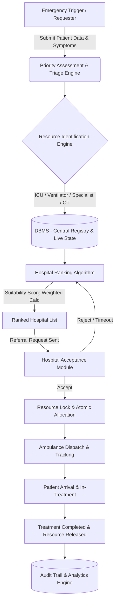

# Product Requirements Document (PRD)

## Project Title
**Smart Emergency Resource Allocation & Hospital Referral System**  
*Tagline: "Not just the nearest hospital — the nearest suitable hospital that can actually handle the emergency."*

---

## 1. Executive Summary & Problem Statement

### 1.1 Problem Statement
During medical emergencies, minutes matter. The standard approach of routing patients strictly to the physically nearest hospital often fails catastrophically:
- The nearest hospital may have zero ICU beds or ventilators available.
- Crucial specialists (e.g., interventional cardiologists, neurosurgeons, trauma surgeons) may be off-shift or unavailable.
- Emergency operation theatres (OTs) may be occupied.
- Families, ambulances, and referring doctors waste critical golden-hour time manually calling multiple hospitals to verify bed and specialist availability.

### 1.2 Proposed Solution
A centralized **Emergency Resource Allocation and Hospital Referral System** backed by:
1. **DBMS (Database Management System):** Maintains structured, transactional records of hospitals, doctors, specialized equipment, ICU beds, ambulances, live status updates, and historical referral audit logs.
2. **OS (Operating System) Resource Engine:** Implements core OS scheduling, synchronization, mutual exclusion locks, priority queues, and deadlock avoidance/safe-state checking (Banker’s Algorithm) to handle competing emergency requests safely without race conditions or double allocation.

---

## 2. Project Goals & Objectives

- **Intelligent Resource-Based Matching:** Match emergency cases based on clinical capability and real-time resource availability rather than distance alone.
- **Priority-Driven Scheduling:** Allocate critical resources using preemptive/non-preemptive priority queuing based on clinical triage severity (e.g., Triage Level 1 Resuscitation vs Level 3 Urgent).
- **Concurrency & Mutual Exclusion:** Prevent race conditions and double-allocation of scarce life-saving resources (ICU beds, ventilators, specialized OTs) using atomic database transactions and lock managers.
- **Closed-Loop Hospital Acceptance:** Enforce explicit handshake confirmations (Accept/Reject) before ambulance dispatch or patient transfer.
- **Integrated Transport Coordination:** Assign and track participating emergency ambulances with live status updates.
- **Full Traceability & Analytics:** Maintain an immutable audit trail of the complete emergency lifecycle (Request $\to$ Triage $\to$ Match $\to$ Lock $\to$ Accept $\to$ Transfer $\to$ Treat $\to$ Release) and provide operational dashboards.
- **OS Safe-State Simulation:** Provide an academic demonstration of deadlock avoidance using Banker's Algorithm during peak emergency load.

---

## 3. System Architecture & Key Concepts



### 3.1 Operating System Concepts Mapped to Emergency Care
| OS Concept | Emergency Resource Engine Application |
| :--- | :--- |
| **Priority Scheduling** | High-triage emergencies (e.g., Cardiac Arrest, Polytrauma) are scheduled ahead of stable cases in the allocation pipeline. |
| **Process States** | Lifecycle states: `NEW` $\to$ `WAITING` $\to$ `ALLOCATED` $\to$ `IN_TREATMENT` $\to$ `COMPLETED` (or `CANCELLED`). |
| **Mutual Exclusion & Locking** | Row-level locking / distributed locks prevent two parallel triage requests from simultaneously claiming the final ICU bed. |
| **Synchronization** | Coordinates simultaneous status updates from doctors, bed managers, and EMS teams. |
| **Priority Queues** | Min/Max-Heap or multi-level feedback queues managing waiting emergency referrals. |
| **Deadlock Avoidance & Banker's Algorithm** | Simulates multi-resource claims (ICU + Ventilator + Neuro Specialist) to avoid unsafe allocation states during mass casualty events. |
| **Resource Release & Deallocation** | Guarantees resource replenishment upon patient discharge or referral completion. |

### 3.2 Database & Transaction Design
- **ACID Transactions:** Strict isolation levels for bed reservation and acceptance routines.
- **Concurrency Controls:** `SELECT ... FOR UPDATE` or optimistic locking with versioning on `MedicalResource` table rows.
- **Audit Logging:** Immutable logging table for referral timestamps, response latency, and outcome records.

---

## 4. User Roles & Capabilities

| Role | Permissions & Core Capabilities |
| :--- | :--- |
| **Emergency Requester / Paramedic / Referring Doctor** | Create emergency requests, specify patient symptoms & triage level, view real-time matched suitable hospitals, view acceptance countdown, track assigned ambulance. |
| **Hospital Staff / Emergency Desk** | Real-time incoming referral notification stream, review patient vitals/needs, 1-click Accept/Reject with rejection reason, manage live inventory (ICU beds, ventilators, on-call specialists). |
| **Ambulance Operator / EMS** | View assigned transport tasks, update live transit status (`DISPATCHED`, `PATIENT_PICKED_UP`, `ARRIVED_AT_HOSPITAL`), broadcast GPS coordinates. |
| **System Administrator / City Command Center** | Global command center monitoring all hospitals, beds, ambulances, active emergencies, hospital response times, analytics dashboards, and OS simulation console. |

---

## 5. Functional Requirements & Feature Specifications

### 5.1 Module 1: Emergency Matching & Ranking Engine
- **Requirement 1.1:** System shall parse emergency request parameters: Emergency Type, Required Resources (ICU Bed, Ventilator, OT, Pediatric Specialist, etc.), and Patient Coordinates.
- **Requirement 1.2:** Hard Constraint Filter: Automatically exclude hospitals that lack any mandatory required resource or have `emergency_status = 'CLOSED'`.
- **Requirement 1.3:** Hospital Ranking Score Formula:
  $$\text{Suitability Score} = (0.40 \times \text{Resource Fit}) + (0.25 \times \text{Historical Acceptance/Response}) + (0.20 \times \text{Available Critical Capacity}) + (0.15 \times \text{Distance Proximity})$$
  *(Weights shall be configurable in system settings).*

### 5.2 Module 2: Concurrency, Locking & Allocation Engine
- **Requirement 2.1:** When a hospital is selected, the system places a temporary **Soft Lock** (TTL: 90 seconds) on the target resources during the hospital acceptance window.
- **Requirement 2.2:** If hospital **Accepts**, the lock converts into a committed **Allocation** in an atomic DBMS transaction.
- **Requirement 2.3:** If hospital **Rejects** or request **Times Out (90s)**, the soft lock is released, and the system fails over immediately to the next ranked hospital in the priority queue.

### 5.3 Module 3: Hospital Operations & Acceptance Portal
- **Requirement 3.1:** Web-based responsive console with visual/auditory alerts on incoming referral.
- **Requirement 3.2:** Quick-action acceptance button with automated resource pre-assignment.
- **Requirement 3.3:** Doctor and specialist on-call shift scheduler.

### 5.4 Module 4: Live Emergency Command Center
- **Requirement 4.1:** Real-time KPI cards:
  - Active Emergencies
  - Critical Cases in Queue
  - Available ICU Beds / Ventilators / Specialist Counts
  - Available Ambulances
  - Average Hospital Referral Response Time (Target < 60s)
- **Requirement 4.2:** Color-Coded Status Tokens:
  - `GREEN` (Normal / Ample Capacity $\ge 20\%$)
  - `YELLOW` (Limited Capacity $< 20\%$)
  - `RED` (Critical Shortage / Zero Capacity / Divert)
- **Requirement 4.3:** Interactive City Map / Heatmap of participating hospitals and ambulances.

### 5.5 Module 5: OS Deadlock & Safe-State Simulator (Academic Module)
- **Requirement 5.1:** Interactive visual simulator for demonstration of Banker's Algorithm.
- **Requirement 5.2:** Ability to configure Available Vectors $[ICU, Ventilator, Specialist]$, Max Matrix, and Allocation Matrix.
- **Requirement 5.3:** Step-by-step display of Safe Sequence computation or detection of potential deadlock state.

### 5.6 Module 6: Analytics & Reporting
- **Requirement 6.1:** Breakdown of emergency volume by classification (Cardiac, Trauma, Stroke, Respiratory, etc.).
- **Requirement 6.2:** Referral Acceptance vs Rejection rates and bottleneck analysis.
- **Requirement 6.3:** Resource utilization heatmaps by hour of day and day of week.

---

## 6. Data Model / DBMS Schema

```
+-----------------------------------------------------------------------------------+
|                                   DATA SCHEMA                                     |
+-----------------------------------------------------------------------------------+

1. Hospital (hospital_id PK, hospital_name, location_lat, location_lng, address, 
             contact_phone, emergency_status [OPEN|LIMITED|CLOSED], rating)

2. Doctor (doctor_id PK, hospital_id FK, name, specialization, 
           availability_status [AVAILABLE|IN_PROCEDURE|OFF_DUTY], shift_start, shift_end)

3. MedicalResource (resource_id PK, hospital_id FK, resource_type [ICU_BED|VENTILATOR|OT|AMBULANCE],
                    total_capacity, available_capacity, locked_capacity, version_lock)

4. Patient (patient_id PK, full_name, age, gender, emergency_type, triage_priority [1-5], contact)

5. EmergencyRequest (request_id PK, patient_id FK, emergency_type, priority, 
                     pickup_lat, pickup_lng, request_time, status [NEW|WAITING|ALLOCATED|IN_TREATMENT|COMPLETED|CANCELLED])

6. HospitalAcceptance (acceptance_id PK, request_id FK, hospital_id FK, 
                       status [PENDING|ACCEPTED|REJECTED|EXPIRED], response_time_seconds, created_at)

7. ResourceAllocation (allocation_id PK, request_id FK, hospital_id FK, resource_id FK, 
                       allocated_at, released_at, status [LOCKED|COMMITTED|RELEASED])

8. Ambulance (ambulance_id PK, hospital_id FK, vehicle_number, type [ALS|BLS], 
              status [AVAILABLE|DISPATCHED|IN_TRANSIT|MAINTENANCE], current_lat, current_lng)

9. EmergencyHistory (history_id PK, request_id FK, hospital_id FK, arrival_time, 
                     treatment_start, treatment_completion, outcome_notes)

10. Alert (alert_id PK, hospital_id FK, request_id FK, alert_type, message, status [UNREAD|ACKNOWLEDGED], created_at)
```

---

## 7. Non-Functional Requirements (NFR)

- **Performance & Latency:** Hospital search and ranking algorithm execution in $< 250\text{ ms}$ for 100+ participating hospitals.
- **Data Integrity & Concurrency:** Zero double-allocation under simulated stress test of 50 simultaneous competing requests for a single remaining resource.
- **Availability:** High availability architecture with graceful degradation (offline fallback list if backend connectivity drops).
- **Security & RBAC:** Role-Based Access Control enforcing strict separation between Requesters, Hospital Staff, and Admin users.
- **Audit Compliance:** Complete immutable timestamps on all state transitions for legal and medical review.

---

## 8. Safety Boundaries & Ethical Guidelines

> [!IMPORTANT]
> **Safety Notice:** This system is an operational coordination, resource management, and scheduling platform. It does NOT provide clinical diagnoses or prescriptive medical treatment plans. Final clinical acceptance and care decisions reside solely with certified healthcare personnel and medical directors.
