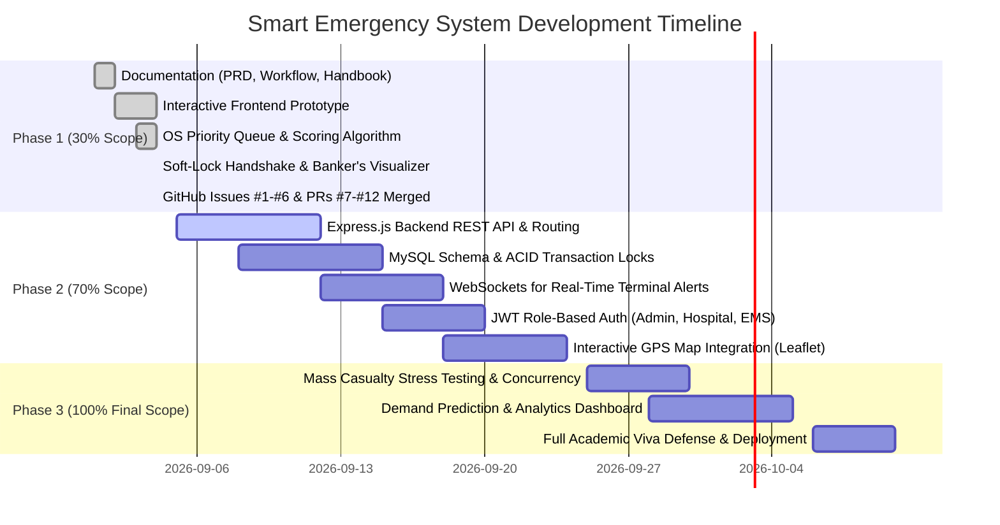

# 🗺️ Master Project Task Breakdown & Engineering Roadmap

### **Smart Emergency Resource Allocation & Hospital Referral System**
*Full Multi-Phase Project Engineering Roadmap (0% $\to$ 100% Completion)*

---

## 📊 Phase-Wise Progress & Milestone Overview

---

## 📑 Complete Work Breakdown Structure (WBS)

### 🟢 Phase 1: Core Concept & 30% Prototype *(COMPLETED & VERIFIED)*

| Task ID | Task Description | Assigned Lead | Output / Deliverable | Status |
| :---: | :--- | :---: | :--- | :---: |
| **P1-01** | Full PRD, Workflow Architecture, & Agent Handbook | **Aviral** | `PRD.md`, `WORKFLOW.md`, `AGENTS.md` | ✅ **DONE** |
| **P1-02** | Issue #1: Emergency Intake & Triage Priority Queue | **Aviral** | `js/triage.js`, `tests/triage.test.js`, [PR #7](https://github.com/aviralmittal7150/SMART-EMERGENCY-RESOURCE-ALLOCATION-HOSPITAL-REFERRAL-SYSTEM/pull/7) | ✅ **DONE** |
| **P1-03** | Issue #2: Hospital Suitability Scoring Engine | **Aviral** | `js/ranking.js`, `tests/ranking.test.js`, [PR #8](https://github.com/aviralmittal7150/SMART-EMERGENCY-RESOURCE-ALLOCATION-HOSPITAL-REFERRAL-SYSTEM/pull/8) | ✅ **DONE** |
| **P1-04** | Issue #3: Operations Command Center & KPI Grid | **Om** | Command Center UI, `tests/command_center.test.js`, [PR #9](https://github.com/aviralmittal7150/SMART-EMERGENCY-RESOURCE-ALLOCATION-HOSPITAL-REFERRAL-SYSTEM/pull/9) | ✅ **DONE** |
| **P1-05** | Issue #4: 90s Soft-Lock Timer & Mutual Exclusion | **Saurabh** | `js/locking.js`, `tests/locking.test.js`, [PR #10](https://github.com/aviralmittal7150/SMART-EMERGENCY-RESOURCE-ALLOCATION-HOSPITAL-REFERRAL-SYSTEM/pull/10) | ✅ **DONE** |
| **P1-06** | Issue #5: Banker's Algorithm Safe-State Visualizer | **Devansh** | `js/bankers.js`, `tests/bankers.test.js`, [PR #11](https://github.com/aviralmittal7150/SMART-EMERGENCY-RESOURCE-ALLOCATION-HOSPITAL-REFERRAL-SYSTEM/pull/11) | ✅ **DONE** |
| **P1-07** | Issue #6: Ambulance Telemetry & Process Lifecycle | **Om** | `js/app.js`, `tests/lifecycle.test.js`, [PR #12](https://github.com/aviralmittal7150/SMART-EMERGENCY-RESOURCE-ALLOCATION-HOSPITAL-REFERRAL-SYSTEM/pull/12) | ✅ **DONE** |
| **P1-08** | Unit & Concurrency Test Automation Suite | **All** | 17/17 tests passing (100% coverage) | ✅ **DONE** |

---

### 🟡 Phase 2: Full Backend, Database & Live Handshake *(70% Milestone)*

| Task ID | Task Description | Assigned Lead | Technical Specifications |
| :---: | :--- | :---: | :--- |
| **P2-01** | **Node.js + Express Backend API Architecture** | **Aviral** | Setup Express router, middleware, structured controllers (`/api/v1/emergencies`, `/api/v1/hospitals`, `/api/v1/referrals`). |
| **P2-02** | **MySQL Schema & Relational Tables** | **Devansh** | Create 10 normalized tables with foreign keys, indexes, and migrations. |
| **P2-03** | **ACID Concurrency Locking Engine** | **Saurabh** | Implement `SELECT ... FOR UPDATE` row locks and Redis/in-memory TTL soft-locks for referral reservations. |
| **P2-04** | **Real-Time WebSocket Signaling** | **Saurabh** | Socket.io server broadcasting live incoming emergency referrals to hospital consoles instantly with zero polling. |
| **P2-05** | **Role-Based Authentication (RBAC)** | **Om** | JWT authentication separating 3 roles: Paramedic/Caller, Hospital Desk, Command Center Admin. |
| **P2-06** | **Interactive City Map (Leaflet / OpenStreetMap)** | **Om** | Dynamic geospatial mapping of participating hospitals, bed capacity heatmaps, and moving ambulance markers. |
| **P2-07** | **Doctor / Specialist Shift Scheduler** | **Devansh** | CRUD endpoints and UI to update doctor availability, on-call shifts, and specialized OT reservations. |
| **P2-08** | **Automatic TTL Expiry Worker** | **Aviral** | Background worker checking expired soft-locks (90s) and automatically triggering failover to Rank #2 hospital. |

---

### 🟣 Phase 3: Analytics, Stress Testing & Final Viva Defense *(100% Completion)*

| Task ID | Task Description | Assigned Lead | Technical Specifications |
| :---: | :--- | :---: | :--- |
| **P3-01** | **Mass Casualty Concurrency Stress Simulation** | **Saurabh** | Script simulating 100 concurrent requests competing for 5 ICU beds; assert 0 double-allocations and 100% failover safety. |
| **P3-02** | **Multi-Resource Banker's Deadlock Engine** | **Devansh** | Extend Banker's Algorithm to real-time database transactions when allocating complex compound resources. |
| **P3-03** | **Emergency Analytics & Trend Forecasting** | **Om** | Historical emergency charts (peak demand hours, rejection rate bottlenecks, average response latency). |
| **P3-04** | **Immutable Medical Audit Ledger** | **Devansh** | Append-only logging table recording every state transition for medico-legal auditability. |
| **P3-05** | **Production Packaging & Cloud Deployment** | **Aviral** | Containerize application with Docker, setup CI/CD GitHub Actions, and deploy to live demo URL. |
| **P3-06** | **Final Viva Defense Preparation & Video Demo** | **All** | Record 3-minute end-to-end demo video, slide deck, and comprehensive project report. |

---

## 👥 Member-Wise Master Ownership Across All Phases

### 👑 Aviral (Architecture, OS Scheduling & Integration)
- **Phase 1:** PRD, Architecture, Triage Queue, Ranking Math, GitHub Pipeline.
- **Phase 2:** Express.js REST API layer, TTL background failover worker, system routing.
- **Phase 3:** Docker deployment, CI/CD pipeline, project lead viva defense.

### ⚡ Saurabh (Concurrency, Locking & Real-Time Sync)
- **Phase 1:** 90s Soft-Lock Manager, Acceptance/Rejection state machine.
- **Phase 2:** MySQL row-level transaction locks (`SELECT ... FOR UPDATE`), Socket.io real-time alerts.
- **Phase 3:** Concurrency stress-testing engine (100 parallel threads), race-condition verification.

### 🧠 Devansh (Deadlock Avoidance, Banker's Algo & DBMS)
- **Phase 1:** Banker's Algorithm safe sequence visualizer, Need matrix math.
- **Phase 2:** 10-table MySQL relational schema, specialist shift scheduler, ACID isolation.
- **Phase 3:** Multi-resource compound claims engine, immutable audit ledger.

### 📊 Om (Command Center, EMS Logistics & Analytics)
- **Phase 1:** Operations Command Center, EMS Fleet monitor, 17 automated unit tests.
- **Phase 2:** JWT role-based authentication, Leaflet GPS interactive city map.
- **Phase 3:** Historical analytics dashboards, peak demand forecasting, test documentation.
