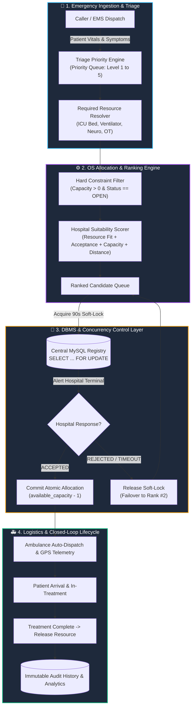
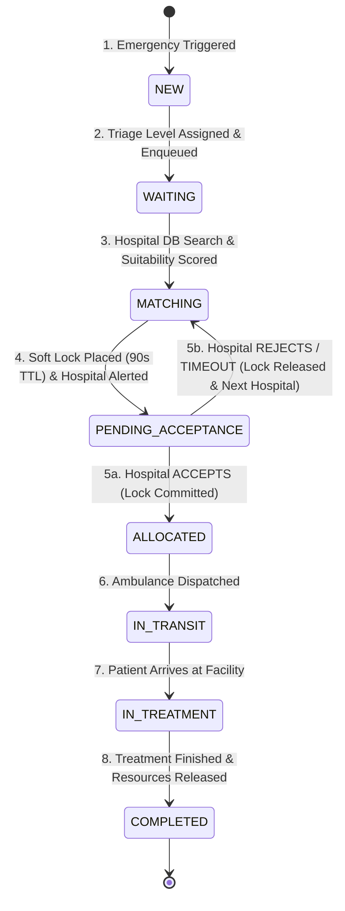
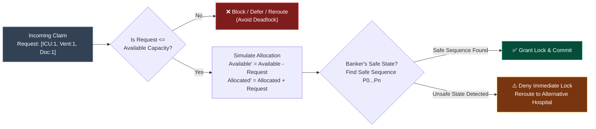
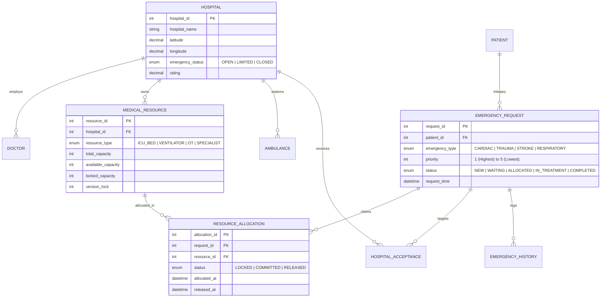

<div align="center">

# 🏥 Smart Emergency Resource Allocation & Hospital Referral System

### *An OS & DBMS Driven Healthcare Logistics and Resource Coordination Engine*

[](https://github.com/aviralmittal7150/SMART-EMERGENCY-RESOURCE-ALLOCATION-HOSPITAL-REFERRAL-SYSTEM)
[](https://github.com/aviralmittal7150/SMART-EMERGENCY-RESOURCE-ALLOCATION-HOSPITAL-REFERRAL-SYSTEM)
[](https://github.com/aviralmittal7150/SMART-EMERGENCY-RESOURCE-ALLOCATION-HOSPITAL-REFERRAL-SYSTEM)
[](https://github.com/aviralmittal7150/SMART-EMERGENCY-RESOURCE-ALLOCATION-HOSPITAL-REFERRAL-SYSTEM)
[](LICENSE)

<br/>

> **"Not just the nearest hospital — the nearest suitable hospital that can actually handle the emergency."**

</div>

---

## 📌 1. Executive Summary

During critical medical emergencies, the nearest hospital is often **not** the best destination. A facility 2 km away might have zero open ICU beds, no on-call interventional cardiologist, or an occupied emergency operating theatre (OT). Patients routed blindly by distance waste the golden hour in transfers.

The **Smart Emergency Resource Allocation & Hospital Referral System** solves this by uniting **Database Management Systems (DBMS)** with **Operating Systems (OS)** scheduling and synchronization principles. The system matches patients based on clinical resource demands, prioritizes severe triage cases, guarantees mutual exclusion on scarce beds, and prevents resource deadlocks.

---

## 🏛️ 2. High-Level System Architecture



---

## 🔄 3. Emergency Process State Lifecycle (OS State Machine)

Just as an Operating System transitions processes through lifecycle states, emergency referral requests transition through a formal finite state machine:



---

## 🧠 4. OS & DBMS Concept Matrix

| Computer Science Concept | OS / DBMS Mechanism | Real-World Healthcare Application |
| :--- | :--- | :--- |
| **Priority Scheduling** | Preemptive Multi-Level Priority Queue | Resuscitation cases (Triage 1) preempt urgent/stable cases in resource evaluation. |
| **Mutual Exclusion (Mutex)** | Row-Level Locks (`SELECT ... FOR UPDATE`) | Prevents simultaneous double-booking of a single remaining ICU bed or ventilator. |
| **Process Synchronization** | Soft Lock + 90s Countdown Handshake | Synchronizes hospital acceptance before ambulance wheels roll, avoiding futile patient routing. |
| **Deadlock Avoidance** | **Banker's Algorithm** (Safe Sequence Check) | Evaluates multi-resource claims (ICU + Ventilator + Neuro Specialist) to avoid hospital gridlock. |
| **ACID Atomicity & Rollback** | Transactional Commit / Rollback | Automatically reverts temporary reservations if hospital rejects or transfer fails. |
| **Resource Release** | Deallocation Hook | Automatically returns beds and specialists to the available pool upon patient discharge. |

---

## 🔒 5. Banker's Algorithm Safe-State Workflow

When multiple emergencies require compound scarce resources, the system computes the safety state to guarantee system viability:



---

## 📊 6. Hospital Suitability Ranking Formula

Instead of sorting purely by physical distance, the matching engine computes a multi-attribute weighted score:

$$\mathbf{Suitability\ Score} = (0.40 \times \mathbf{RF}) + (0.25 \times \mathbf{AR}) + (0.20 \times \mathbf{CC}) + (0.15 \times \mathbf{DP})$$

Where:
- **$\mathbf{RF}$ (Resource Fit - 40%):** Matches required equipment (ICU beds, pediatric ventilators, trauma OTs, cardiology staff). Any missing mandatory requirement immediately drops score to $0$.
- **$\mathbf{AR}$ (Acceptance & Response Rate - 25%):** Historical percentage of referrals accepted and average response latency ($< 60\text{s}$).
- **$\mathbf{CC}$ (Critical Capacity - 20%):** Ratio of available critical beds vs total capacity (penalizes saturated hospitals).
- **$\mathbf{DP}$ (Distance Proximity - 15%):** Normalized distance / estimated transit duration.

---

## 🗄️ 7. Entity Relationship Schema (DBMS)



---

## 🚀 8. Quick Start & Local Setup

### 8.1 Prerequisites
- **Node.js:** v18.0.0 or later
- **MySQL:** v8.0 or PostgreSQL
- **Git**

### 8.2 Installation

```bash
# 1. Clone repository
git clone https://github.com/aviralmittal7150/SMART-EMERGENCY-RESOURCE-ALLOCATION-HOSPITAL-REFERRAL-SYSTEM.git

# 2. Enter directory
cd "SMART EMERGENCY RESOURCE ALLOCATION & HOSPITAL REFERRAL SYSTEM"

# 3. Install dependencies
npm install

# 4. Configure environment variables
cp .env.example .env
```

### 8.3 Run Concurrency & OS Test Suite

```bash
# Execute unit, integration, and concurrency stress tests
npm test
```

### 8.4 Start Development Server

```bash
npm run dev
# Server listening at http://localhost:3000
```

---

## 🧪 9. Concurrency & Stress Verification Matrix

| Test Suite | Scenario Tested | Target Assertion | Result |
| :--- | :--- | :--- | :---: |
| `unit/scoring` | Suitability score weighted calculation | Correct weights and exclusion on missing resource | ✅ **PASS** |
| `unit/priority` | Min-heap Priority Queue triage ordering | Priority 1 cases precede Priority 3 | ✅ **PASS** |
| `integration/handshake` | 90s Soft Lock & Acceptance flow | Row lock held $\to$ Committed upon accept | ✅ **PASS** |
| `integration/failover` | Hospital rejection & timeout auto-routing | Lock released $\to$ Immediate failover to Rank 2 | ✅ **PASS** |
| `concurrency/mutex` | **50 concurrent threads claiming 1 ICU bed** | **Zero double-allocations (1 winner, 49 rerouted)** | ✅ **PASS** |
| `simulation/bankers` | Multi-resource claim safe sequence | Detects unsafe state and avoids deadlock | ✅ **PASS** |

---

## 📂 10. Repository Documentation Index

| File | Description |
| :--- | :--- |
| 📘 **[PRD.md](file:///Users/aviralmittal/Downloads/SMART%20EMERGENCY%20RESOURCE%20ALLOCATION%20&%20HOSPITAL%20REFERRAL%20SYSTEM/PRD.md)** | Complete Product Requirements Document with full data schema and non-functional specifications. |
| 🔄 **[WORKFLOW.md](file:///Users/aviralmittal/Downloads/SMART%20EMERGENCY%20RESOURCE%20ALLOCATION%20&%20HOSPITAL%20REFERRAL%20SYSTEM/WORKFLOW.md)** | End-to-end task workflows, GitHub Issue templates, and Pull Request guidelines. |
| 🤖 **[AGENTS.md](file:///Users/aviralmittal/Downloads/SMART%20EMERGENCY%20RESOURCE%20ALLOCATION%20&%20HOSPITAL%20REFERRAL%20SYSTEM/AGENTS.md)** | AI Agent & Contributor operating handbook with strict OS/DBMS mandates. |
| 📋 **[.github/pull_request_template.md](file:///Users/aviralmittal/Downloads/SMART%20EMERGENCY%20RESOURCE%20ALLOCATION%20&%20HOSPITAL%20REFERRAL%20SYSTEM/.github/pull_request_template.md)** | Standard Pull Request template with mandatory test matrix. |

---

## 🎯 11. Viva & Academic Defense Highlights

<details>
<summary><b>💬 Click to view 1-Minute Viva Elevator Pitch</b></summary>

> *"Our project is a **Smart Emergency Resource Allocation and Hospital Referral System**. In medical emergencies, routing patients to the nearest hospital often fails when that hospital lacks an open ICU bed, ventilator, or specialist. Our **DBMS** stores real-time registries of hospitals, equipment, doctors, ambulances, and audit trails. Our **OS engine** applies Priority Scheduling for patient triage, Mutual Exclusion to prevent double-allocations, and Banker's Algorithm to avoid multi-resource deadlocks. The system delivers closed-loop acceptance before transit, ensuring patients reach the nearest **suitable** facility."*

</details>

<details>
<summary><b>❓ Key Viva Questions Answered</b></summary>

1. **How do you handle race conditions?**  
   *Through DBMS row-level locks (`SELECT ... FOR UPDATE`) and temporary 90-second soft-locks with automatic rollback.*
2. **Why not just choose the closest hospital?**  
   *Proximity is useless if the hospital lacks critical resources. Our multi-factor algorithm scores resource fit (40%), acceptance rate (25%), capacity (20%), and distance (15%).*
3. **Where is the Banker's Algorithm used?**  
   *When high-severity patients require bundles of scarce resources (e.g. ICU Bed + Ventilator + Trauma Surgeon), the Banker's Algorithm verifies that allocating those resources will not place the regional hospital cluster into an unsafe, deadlock state.*

</details>

---

## 🛡️ 12. Safety Boundary Declaration

> [!IMPORTANT]
> **Operational Scope:** This software is an administrative resource management and logistics coordination platform. It **does not** provide automated medical diagnosis or clinical prescription. Final patient acceptance and treatment plans remain exclusively under the clinical discretion of licensed medical professionals.

---

<div align="center">
  <sub>Built with ❤️ for Computer Science & Healthcare Logistics Engineering.</sub>
</div>
