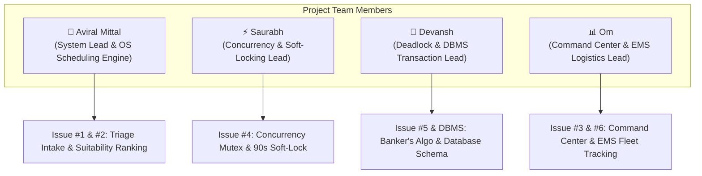

# 👥 Team Roles & Task Division Matrix

### **Smart Emergency Resource Allocation & Hospital Referral System**
*Project Based Learning (PBL) — OS + DBMS Healthcare Logistics System*

---

## 🏆 Team Structure & Member Allocations



---

## 📋 Detailed Task & Responsibility Breakdown

### 1. 👑 Aviral (Team Lead & OS Scheduling Engine)
- **Primary Domain:** System Architecture, OS Priority Queue, Hospital Ranking Formula, & GitHub Repository Management.
- **Key Modules & Issues:**
  - **Issue #1:** Emergency Ingestion & Priority Triage Portal (Triage Levels 1–5, FIFO tie-breaking, clinical symptom presets).
  - **Issue #2:** Hospital Suitability Ranking Engine ($0.40 \times \text{Resource Fit} + 0.25 \times \text{Acceptance} + 0.20 \times \text{Capacity} + 0.15 \times \text{Distance}$).
  - Repository coordination, CI/CD PR review pipeline, and system integration.
- **Viva Defense Focus:**
  - *Why distance alone fails during critical emergencies.*
  - *How priority scheduling mathematically optimizes triage order.*
  - *How hard constraint exclusions prevent routing to hospitals without critical specialists.*

---

### 2. ⚡ Saurabh (Concurrency & Soft-Locking Lead)
- **Primary Domain:** OS Mutual Exclusion, Concurrency Control, 90-Second Soft-Lock TTL, & Closed-Loop Handshake.
- **Key Modules & Issues:**
  - **Issue #4:** Hospital Acceptance Terminal with 90s Soft-Lock Timer.
  - Concurrency Lock Manager: Preventing double-allocation of scarce ICU beds.
  - Automatic failover logic: Immediate rerouting to Rank #2 hospital upon rejection or 90s timeout.
  - Concurrency test validation (50 concurrent requests competing for 1 bed).
- **Viva Defense Focus:**
  - *How mutual exclusion is enforced across concurrent emergency claims.*
  - *The exact lifecycle of a 90-second soft-lock (Locked $\to$ Committed vs Expired/Rollback).*
  - *Why closed-loop hospital acceptance avoids futile patient transport.*

---

### 3. 🧠 Devansh (Deadlock Avoidance & DBMS Layer Lead)
- **Primary Domain:** OS Banker's Algorithm, Safe-State Detection, & Relational Database Design.
- **Key Modules & Issues:**
  - **Issue #5:** OS Deadlock & Banker's Algorithm Interactive Simulator.
  - Matrix calculation for multi-resource claims ($[ICU, Ventilator, Specialist]$): Available Vector, Max Matrix, Allocation Matrix, and Need Matrix ($\text{Need} = \text{Max} - \text{Allocation}$).
  - Safe sequence discovery ($\langle P_0 \to P_1 \to P_2 \dots \rangle$) and deadlock hazard alerting.
  - DBMS Relational Schema (10 tables) and ACID transaction isolation models.
- **Viva Defense Focus:**
  - *How Banker's Algorithm guarantees deadlock avoidance during peak multi-resource demand.*
  - *How the Need Matrix is computed and evaluated against the Work vector.*
  - *Database ACID properties and row-level locking (`SELECT ... FOR UPDATE`).*

---

### 4. 📊 Om (Command Center, EMS Fleet & Testing Lead)
- **Primary Domain:** Operations UI/UX, EMS Fleet Tracking, Process State Lifecycle, & Automated Test Suite.
- **Key Modules & Issues:**
  - **Issue #3:** Live Emergency Operations Command Center Dashboard (KPI cards, capacity tokens, hospital directory).
  - **Issue #6:** Ambulance Fleet Dispatch & Process State Tracker (`NEW` $\to$ `WAITING` $\to$ `ALLOCATED` $\to$ `IN_TREATMENT` $\to$ `COMPLETED`).
  - Automated test suite coordination (`npm test` across all 17 test cases).
  - Telemetry and live status indicators for ALS/BLS transport units.
- **Viva Defense Focus:**
  - *How the command center aggregates regional hospital capacity in real time.*
  - *How the OS process state lifecycle mirrors patient progression from triage to discharge.*
  - *Automated test results and verification evidence.*

---

## 🎯 Viva & Presentation Speaking Order

```
┌─────────────────────────────────────────────────────────────────────────────┐
│ 1. Aviral: Introduction, Problem Statement, System Architecture, & Triage  │
│    "Why the nearest hospital is often the wrong hospital."                  │
├─────────────────────────────────────────────────────────────────────────────┤
│ 2. Saurabh: Concurrency, 90s Soft-Locking, & Referral Acceptance Flow       │
│    "How mutual exclusion prevents double booking scarce ICU beds."          │
├─────────────────────────────────────────────────────────────────────────────┤
│ 3. Devansh: Banker's Algorithm Safe-State Simulator & DBMS Design           │
│    "How deadlock avoidance guarantees system stability under heavy load."   │
├─────────────────────────────────────────────────────────────────────────────┤
│ 4. Om: Live Operations Command Center, Ambulance Fleet, & Test Results      │
│    "Real-time citywide visibility and 100% passing test matrix."            │
└─────────────────────────────────────────────────────────────────────────────┘
```
