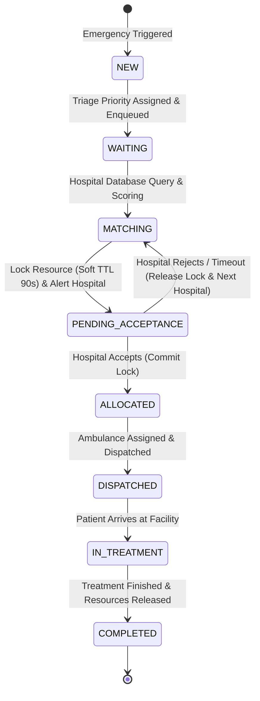
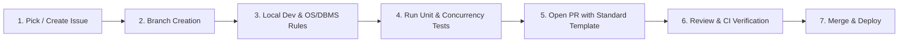

# Task & Development Workflow Guide

This document establishes the end-to-end task workflows, engineering lifecycle, GitHub Issue formatting, and Pull Request (PR) standards for the **Smart Emergency Resource Allocation & Hospital Referral System**.

---

## 1. System Operational Workflow (Emergency Lifecycle)



### Step-by-Step Emergency Request Phase Breakdown

1. **Step 1: Ingestion & Triage**
   - Caller/EMS inputs patient age, triage severity (Priority 1 to 5), suspected condition, and required resources (e.g., `ICU_BED`, `VENTILATOR`, `NEUROLOGIST`).
2. **Step 2: Candidate Hospital Filtering & Ranking**
   - Filters out full/closed hospitals.
   - Computes Multi-Factor Suitability Score (Resource Fit 40%, Acceptance History 25%, Critical Capacity 20%, Distance 15%).
3. **Step 3: Concurrency Control & Soft Locking**
   - System invokes a transactional lock on the candidate hospital's resource row (`locked_capacity = locked_capacity + 1`).
   - Dispatches priority alert to hospital receiving terminal with a 90-second response window.
4. **Step 4: Hospital Response & Failover**
   - **Acceptance:** Status $\to$ `ACCEPTED`. Row updated: `available_capacity = available_capacity - 1`, `locked_capacity = locked_capacity - 1`.
   - **Rejection / Timeout:** Soft lock released (`locked_capacity = locked_capacity - 1`), state returns to `MATCHING`, candidate hospital bypassed, referral forwarded to Rank #2 hospital.
5. **Step 5: Transport & Treatment**
   - Ambulance is dispatched with route telemetry.
   - On arrival, status advances to `IN_TREATMENT`.
6. **Step 6: Deallocation & Audit Log**
   - Doctor completes emergency care; resources are returned to available inventory.
   - Full timeline written to immutable `EmergencyHistory` audit ledger.

---

## 2. Engineering & Feature Development Workflow

When contributing features or resolving issues in the codebase:



1. **Issue Creation:** Every task, bug, or feature MUST have a corresponding GitHub Issue formatted using the standard issue template.
2. **Branch Naming Convention:**
   - Feature: `feat/<issue-number>-<short-description>` (e.g., `feat/42-bankers-safe-state-engine`)
   - Bugfix: `fix/<issue-number>-<short-description>` (e.g., `fix/19-icu-bed-race-condition`)
   - Documentation: `docs/<issue-number>-<short-description>` (e.g., `docs/05-api-contract-specs`)
   - Performance: `perf/<issue-number>-<short-description>`
3. **Coding Standards:**
   - Ensure ACID transaction compliance for all state changes.
   - Implement mutual exclusion / locking for any multi-client access.
   - Maintain full test coverage (Unit, Integration, and Concurrency Stress Tests).
4. **Pull Request Submission:** Fill out the standardized Pull Request template with passing test cases and execution logs.

---

## 3. GitHub Issue Formation Standards & Templates

All project issues must follow one of the structured templates below.

### 3.1 Feature Request Issue Template

```markdown
---
name: "✨ Feature Request"
about: Propose a new feature or enhancement for the Smart Emergency System
title: "[FEAT]: <Short descriptive summary>"
labels: ["enhancement", "needs-triage"]
assignees: ""
---

### 📌 Feature Summary
<!-- Clear, 1-2 sentence description of what this feature does and why it is needed. -->

### 🎯 Module & System Component
- [ ] Emergency Matching & Ranking Engine
- [ ] OS Concurrency & Resource Locking
- [ ] Hospital Acceptance Console
- [ ] Ambulance / EMS Dispatch
- [ ] Live Command Center & Heatmap
- [ ] OS Deadlock / Banker's Algorithm Simulator
- [ ] Analytics & Reporting
- [ ] DBMS Schema & Database Layer

### 📋 Requirements & User Stories
- **As a** [user role: Paramedic / Doctor / Admin]
- **I want to** [perform specific action]
- **So that** [expected benefit or clinical outcome]

### ⚙️ Technical Approach & OS / DBMS Considerations
- **DBMS Operations:** (e.g. Transactions, tables affected, locks needed)
- **OS Concepts Applied:** (e.g. Priority Scheduling, Semaphores, Banker's Safe State)
- **API Endpoints Proposed:** (e.g. `POST /api/v1/referrals/accept`)

### ✅ Acceptance Criteria
- [ ] Criteria 1: 
- [ ] Criteria 2: 
- [ ] Criteria 3: 
- [ ] Concurrency / Stress verification passes with zero race conditions.
```

---

### 3.2 Bug Report Issue Template

```markdown
---
name: "🐛 Bug Report"
about: Report a defect, race condition, or allocation anomaly
title: "[BUG]: <Concise title describing the failure>"
labels: ["bug", "triage"]
assignees: ""
---

### 🐛 Bug Description
<!-- Clear and concise description of what the bug is. -->

### 🔁 Reproduction Steps
1. Navigate to '...'
2. Trigger action '...' with payload:
   ```json
   { "request_id": "REQ-101", "priority": 1 }
   ```
3. Observe resource allocation state.

### 💥 Expected Behavior vs Actual Behavior
- **Expected:** (e.g., Bed count should decrement by 1 and lock held for 90s)
- **Actual:** (e.g., Two concurrent requests simultaneously allocated the same single bed)

### 📊 Concurrency & Database Log Snippet
```sql
-- Paste relevant transaction / error logs here
```

### 💻 Environment
- OS: [e.g. macOS / Linux]
- Node / Runtime: [e.g. v20.x]
- Database: [e.g. MySQL 8.0 / PostgreSQL]
- Severity: [Critical (Data Corruption/Double Allocation) / High / Medium / Low]
```

---

## 4. GitHub Pull Request (PR) Formation Template

When creating a Pull Request, use the standard template below. **All PRs must include full descriptions, verification test evidence, and confirmation that all test cases have passed.**

```markdown
## 📝 Pull Request Summary
<!-- Provide a high-level summary of the changes introduced in this PR. -->

Closes #<!-- Issue number, e.g. #42 -->

---

### 🔍 Changes Made
- **Component 1:** Summary of changes...
- **Component 2:** Summary of changes...
- **Database / OS Layer:** Transaction locks, schema updates, or scheduling algorithms modified...

---

### 🧠 OS & DBMS Concept Validation
| Concept Checked | Implementation Detail | Verified |
| :--- | :--- | :---: |
| **Mutual Exclusion** | Row-level locking applied to `MedicalResource` table preventing double allocation | ✅ |
| **Priority Queue** | Higher triage emergencies (Priority 1) preempt Priority 3 in referral matching | ✅ |
| **Atomicity** | Rollback tested on hospital rejection or allocation timeout | ✅ |
| **Safe-State Check** | Banker's Algorithm avoids allocation if system enters unsafe state | ✅ |

---

### 🧪 Test Cases & Verification Matrix

> [!IMPORTANT]
> **All unit, integration, and concurrency stress tests must pass before merging.**

```bash
# Test Execution Command:
npm test
```

#### Test Suite Results
| Test Suite / Category | Test Case Name | Status | Latency |
| :--- | :--- | :---: | :---: |
| **Unit Tests** | `test_hospital_suitability_score_calculation` | ✅ PASS | 4ms |
| **Unit Tests** | `test_triage_priority_queue_ordering` | ✅ PASS | 2ms |
| **Integration** | `test_referral_handshake_accept_flow` | ✅ PASS | 45ms |
| **Integration** | `test_referral_timeout_failover_to_rank2` | ✅ PASS | 92ms |
| **Concurrency Stress** | `test_50_concurrent_requests_for_1_icu_bed` | ✅ PASS (0 Double Allocations) | 120ms |
| **OS Simulation** | `test_bankers_algorithm_safe_sequence_detection` | ✅ PASS | 8ms |

**Overall Result:** `6 Passed, 0 Failed, 0 Skipped` (100% Pass Rate)

---

### 📸 Screenshots & Execution Logs (Before & After)

#### Verification Logs
```log
[INFO] 2026-09-04 22:15:00 - Starting concurrency allocation test: 50 threads -> 1 ICU Bed
[LOCK] Thread #12 acquired lock on Hospital ID: H-04, Resource: ICU_BED_01
[COMMIT] Thread #12 allocated successfully. Remaining Available: 0
[REJECT] Threads #1-11, #13-50 safely queued / rerouted to next hospital.
[SUCCESS] Concurrency test passed with 0 race conditions.
```

---

### 📋 Pre-Merge Checklist
- [x] Code adheres to repository style guides and architecture principles.
- [x] All unit, integration, and stress test cases passed locally and in CI.
- [x] No sensitive credentials or hardcoded keys committed.
- [x] Database migrations (if any) are backward-compatible and tested.
- [x] Updated documentation and API schemas.
- [x] Safety boundary maintained (no medical diagnosis claims).
```
